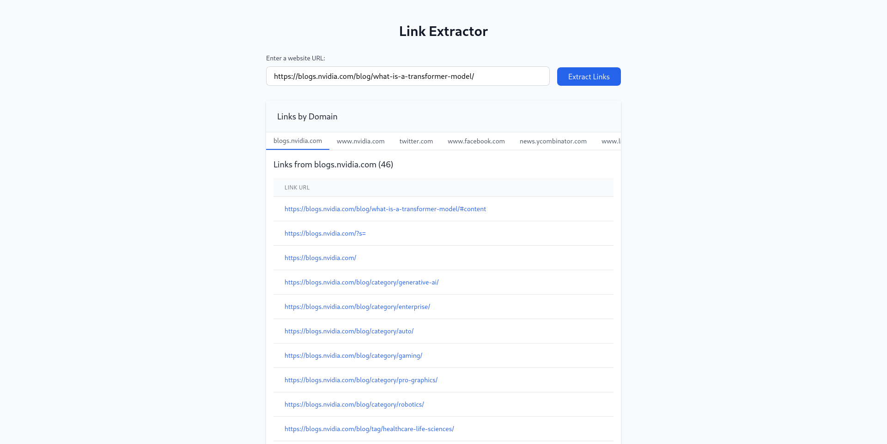

# Link Checker

A simple web application that allows users to extract all the links from a given webpage and displays them grouped by their host URL. Built with **React** on the frontend and **Express.js** on the backend.
Deployed at this link

## Features

-   Enter a website URL to extract all the links from the page.
-   Links are displayed in a categorized manner based on their host URLs




## Problems Faced

-   Just using React wasn't possible due to CORS. Hence needed a server just to fetch the website and parse the links.
-   One alternative was using a public proxy server like ProxyAnywhere directly from Frontend.
-   Could be done directly if Chrome Extention was used which has direct access to the webpage.
-   Another alternative is Playwright or Selenium to simulate webpage. But could be more time consuming and resource intensive.

## Tech Stack

-   **Frontend:** React
-   **Backend:** Express.js, Node.js
-   **API for scraping links:** axios, jsdom

## Deployment

This app is deployed on vercel at - https://link-checker-8g7p.vercel.app/

## Installation

1. Clone the repository:

    ```bash
    git clone https://github.com/yourusername/link-extractor.git
    cd link-extractor
    ```

2. Install dependencies for both frontend and backend:

    ### Backend (Express API):

    ```bash
    cd server
    npm install
    ```

    ### Frontend (React App):

    ```bash
    cd frontend
    npm install
    ```

3. Add environment variables in both frontend and backend:

    ### Frontend:

    Create a `.env` file in the `frontend` directory and add:

    ```
    VITE_SERVER=http://localhost:8000/   # Replace with the actual backend URL when deployed
    ```

## Running the Project Locally

1. Start the backend server:

    ```bash
    cd server
    npm run dev  # This will start the Express server using nodemon
    ```

2. Start the frontend development server:

    ```bash
    cd frontend
    npm run dev  # This will start the Vite development server
    ```

3. Visit the frontend at `http://localhost:3000` and enter a URL to extract links from.
